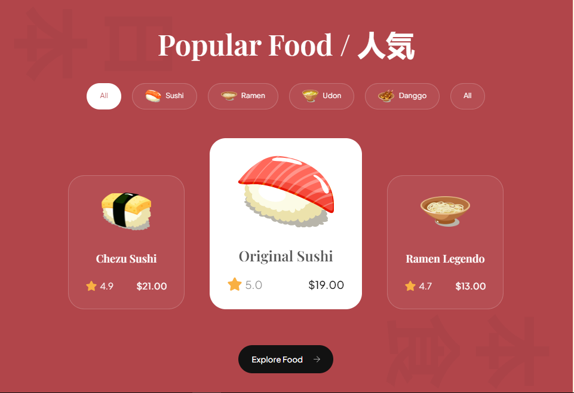

<h1 align="center">Sushiman - Japanese Food</h1>
<p>Feel the taste of the most popular Japanese food from anywhere and
anytime.</p>

<p>
Sushi is a traditional Japanese dish that has gained immense popularity worldwide. It is known for its artful presentation, delicate flavors, and the skilled craftsmanship required to make it.

At its core, sushi consists of vinegared rice combined with various ingredients such as raw or cooked seafood, vegetables, and sometimes even tropical fruits. The rice used in sushi is typically short-grain rice, which is cooked and seasoned with a mixture of rice vinegar, sugar, and salt. This gives the rice a slightly tangy and sweet flavor.

</p>


<h2>🧐 Sections</h2>

Here're the section of the project's:

- Hero section
- Menu
- Food
- Services
- About Us

<h2>🚀 Demo</h2>

[https://masud-rana44.github.io/Sushi-landing-page/](https://masud-rana44.github.io/Sushi-landing-page/)

<h2>Project Screenshots:</h2>





<h2>🛠️ Installation Steps:</h2>

<p>1. Clone the repository</p>

```
git clone https://github.com/masud-rana44/Sushi-landing-page
```

<p>2. Install the dependencies</p>

```
npm install
```

<p>3. Start server on localhost</p>

```
npm run preview
```

<h2>💻 Built with</h2>

Technologies used in the project:

- [html](#) - For desgin the skeleton
- [css](#) - For styleing

<h2>💖Like my work?</h2>

This project needs a ⭐️ from you. Don't forget to leave a star ⭐️.
